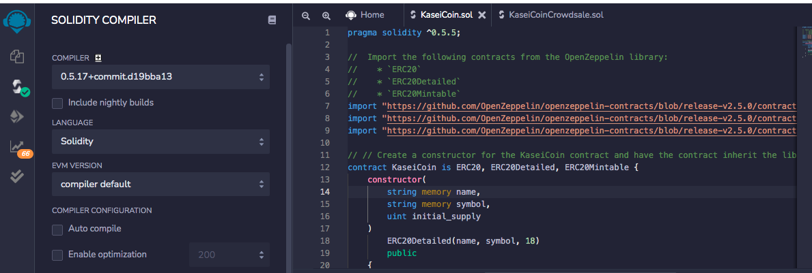
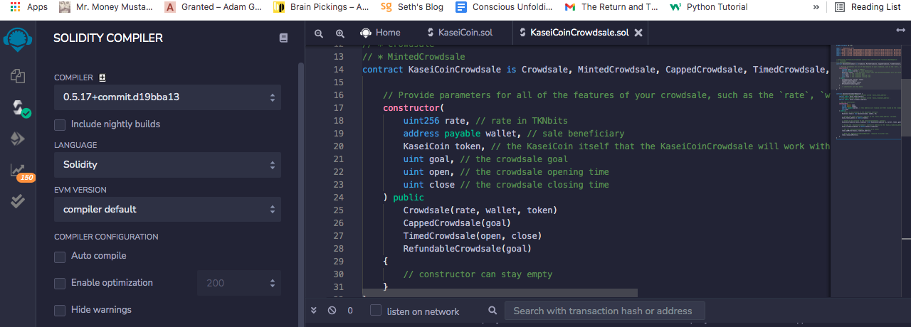
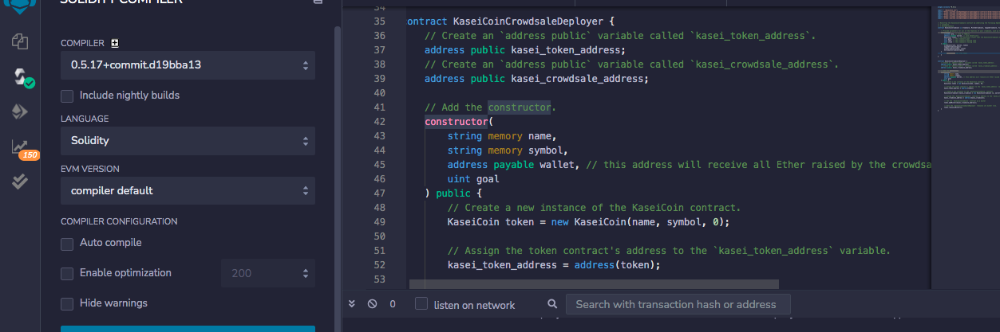
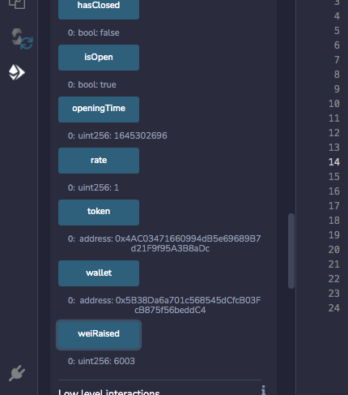
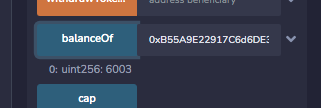
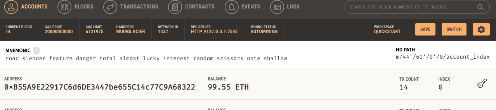

# Summary of a Fungible Token ERC20

This code creates KaseiCoin. KaseiCoin is a fungible token that is ERC-20 compliant. I simulated a crowdsale that  allows people to convert their money to KaseiCoin.

This token was minted using a ```Crowdsale``` contract from OpenZeppelin Solidity library.

The crowdsale contract that I created manages the entire crowdsale process, allowing users to send ether to the contract and in return receive KAI, or KaseiCoin tokens. This contract will mint the tokens automatically and distribute them to buyers in one transaction.


### Usage

Create and compile the KaseiCoin Token Contract 




Create and compile the KaseiCoin Crowdsale Contract



Create the KaseiCoin Deployer Contract



Deploy the Crowdsale to a Local Blockchain using Remix, Ganache, and Metamask



Test the functionality of the crowdsale by using test accounts to buy new tokens



Check the balances associated with those accounts.



## Contributors
[Andrew Crawford](https://www.linkedin.com/in/crawnicles/)

e-mail: crawnicles@gmail.com


